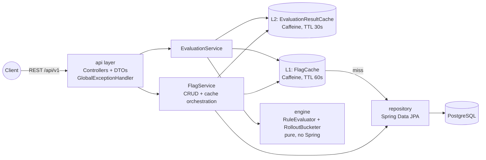
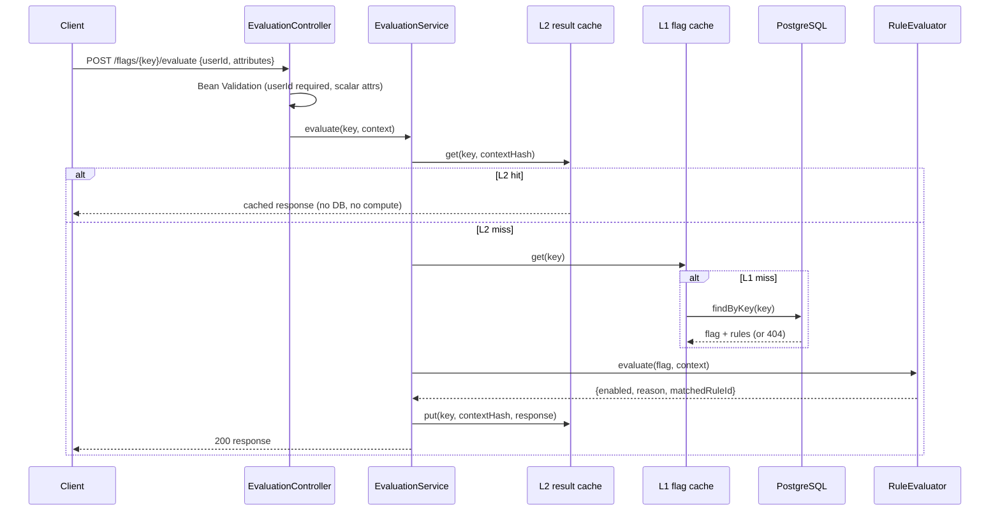

# Architecture — Feature Flag as a Service (ffaas)

Java 21 · Spring Boot 3.x · Maven · PostgreSQL · Caffeine. Single-instance service; see [Known limitations](#8-known-limitations--future-work).

---

## 1. Component Overview



### Package layout (`com.ffaas`)

| Package | Contents | Responsibility |
|---|---|---|
| `api` | `FlagController`, `EvaluationController`, request/response DTOs, `GlobalExceptionHandler` | HTTP concerns only: routing, (de)serialization, Bean Validation, error envelope. No business logic. |
| `service` | `FlagService`, `EvaluationService` | Use-case orchestration, transactions, cache coordination. |
| `engine` | `RuleEvaluator`, `RolloutBucketer`, `EvaluationResult` | **Pure, stateless, framework-free** decision logic. Takes a flag definition + context, returns a result. Trivially unit-testable. |
| `cache` | `FlagCache` (L1), `EvaluationResultCache` (L2) | Thin wrappers around Caffeine; own the key schemes and eviction API. |
| `repository` | `FeatureFlagRepository` | Spring Data JPA. |
| `domain` | `FeatureFlag`, `Rule` entities; `Condition`, `Operator` value types | Persistence model. |
| `config` | `CacheConfig`, Jackson config | Wiring, tunables from `application.yml`. |

**Dependency direction:** `api → service → (engine, cache, repository) → domain`. The engine never touches Spring, JPA, or the cache — it is handed plain objects.

---

## 2. Request Lifecycle

### 2.1 Evaluate (hot path) — `POST /flags/{key}/evaluate`



Steps: validate → L2 lookup → L1 lookup (miss → DB load, populate L1) → pure engine evaluation → store in L2 → respond. A warm flag evaluates with **zero DB round-trips**.

### 2.2 Write path — `POST/PUT/DELETE /flags*`

validate DTO (+ cross-field: unique priorities, operator/value compatibility) → transactional persist → **on commit:** `L1.evict(key)` and `L2.evictAllForFlag(key)` → respond. Eviction after commit guarantees no reader re-caches pre-commit state.

---

## 3. Rule Engine

- Rules sorted by ascending `priority`; **first match wins** (OR across rules).
- Within a rule, all conditions must match (AND).
- Missing context attribute ⇒ condition false, never an error.
- Operators: `EQ`, `NEQ` (type-aware equality, numeric coercion), `IN`, `NOT_IN` (array membership), `GT`, `LT` (numeric only).
- No match ⇒ flag's `defaultState`, reason `DEFAULT`. Global `enabled=false` short-circuits everything to `FLAG_DISABLED`.

**Rollout (extension, additive):** a matched rule with non-null `rolloutPercentage` runs `bucket = abs(murmur3_32(flagKey + ":" + userId)) % 100`; included iff `bucket < percentage`. `null` ⇒ 100% — the core flow never involves bucketing. Excluded ⇒ `ROLLOUT_EXCLUDED`, serve `defaultState`.

*Why first-match-wins + priority?* Deterministic, explainable (`matchedRuleId` + `reason` in every response), and matches how operators reason about targeting ("premium users first, then beta list, else default"). *Why hash-based rollout?* Stateless and deterministic — no per-user assignment storage; the same user always sees the same result; keyed by `flagKey + userId` so buckets are independent across flags.

---

## 4. Caching Design

| | L1 — flag definitions | L2 — evaluation results |
|---|---|---|
| Key | `flagKey` | `flagKey` + SHA-256 of normalized context (sorted attribute map + userId) |
| Value | Full flag + rules (immutable snapshot) | Evaluation response |
| TTL | 60 s (staleness safety net) | 30 s |
| Max size | 10 000 | 10 000 |
| Invalidation | `evict(key)` on update/delete | `evictAllForFlag(key)` on update/delete (per-flag key index) |
| Purpose | Eliminate DB reads on the hot path | Eliminate repeated compute + hashing for identical (flag, context) pairs |

### Invalidation matrix

| Event | L1 | L2 |
|---|---|---|
| Flag created | — (no stale entry possible; negative caching not used) | — |
| Flag updated | evict key | evict all entries for key |
| Flag deleted | evict key | evict all entries for key |
| TTL expiry | auto (60 s) | auto (30 s) |

### Graceful fallback

`EvaluationService` wraps the DB load: on `DataAccessException`, if L1 still holds the flag, serve it and log `WARN db_unavailable_served_from_cache`; otherwise `503 SERVICE_UNAVAILABLE`. CRUD never falls back — writes against an unreachable DB fail loudly with `503`.

### Correctness invariants
1. Results are never shared across contexts — the L2 hash covers userId + every attribute.
2. Cached flag snapshots are immutable (defensive copy / record types), so the engine can't mutate cached state.
3. Worst-case staleness after a write on a single instance = 0 (write-through eviction); TTLs only bound staleness for edge cases (e.g., out-of-band DB edits).

*Why Caffeine?* In-process (no network hop — the point of the requirement), near-optimal hit rates (W-TinyLFU), built-in TTL/size bounds and `recordStats()` for observability, and it's the cache Spring's own caching abstraction defaults to.

---

## 5. Data Model (PostgreSQL, Flyway `V1__init.sql`)

```sql
CREATE TABLE feature_flags (
    id            UUID PRIMARY KEY,
    key           VARCHAR(64)  NOT NULL UNIQUE,
    name          VARCHAR(100) NOT NULL,
    description   VARCHAR(500),
    enabled       BOOLEAN      NOT NULL DEFAULT TRUE,
    default_state BOOLEAN      NOT NULL DEFAULT FALSE,
    created_at    TIMESTAMPTZ  NOT NULL,
    updated_at    TIMESTAMPTZ  NOT NULL
);

CREATE TABLE flag_rules (
    id                 UUID PRIMARY KEY,
    flag_id            UUID NOT NULL REFERENCES feature_flags(id) ON DELETE CASCADE,
    priority           INT  NOT NULL CHECK (priority >= 0),
    serve              BOOLEAN NOT NULL,
    rollout_percentage INT CHECK (rollout_percentage BETWEEN 0 AND 100),
    conditions         JSONB NOT NULL,
    UNIQUE (flag_id, priority)
);

CREATE INDEX idx_flag_rules_flag_id ON flag_rules(flag_id);
```

Conditions live as a JSONB array on the rule (heterogeneous value types, always read/written with their rule as one unit, never queried independently) — a third normalized table would add joins for no query benefit. Flags load rules eagerly ordered by priority; the whole aggregate is what L1 caches.

---

## 6. Validation & Error Handling

- **Structural validation:** Bean Validation annotations on DTOs (`@NotBlank`, `@Pattern` for key, `@Size`, `@Min/@Max`); unknown JSON fields rejected (Jackson `FAIL_ON_UNKNOWN_PROPERTIES`).
- **Semantic validation:** custom validator for operator/value compatibility (IN ⇒ non-empty array, GT/LT ⇒ numeric), unique priorities per flag, scalar-only context attributes.
- **`GlobalExceptionHandler`** (`@RestControllerAdvice`) maps all failures to the single error envelope (see PRD §6): `MethodArgumentNotValidException → 400 VALIDATION_FAILED` (field-level details), `HttpMessageNotReadableException → 400 MALFORMED_JSON`, `FlagNotFoundException → 404`, `DuplicateFlagKeyException → 409` (also guards the DB unique constraint race), `DataAccessException → 503`, catch-all `→ 500 INTERNAL_ERROR` with a safe message (no stack traces to clients).

---

## 7. Testing & CI Strategy

| Layer | Approach |
|---|---|
| `engine` | Pure JUnit 5 — the deepest suite: every operator, type mismatches, missing attributes, priority ordering, first-match-wins, empty rules, disabled flag; rollout: determinism, 0/100 boundaries, distribution sanity |
| `service` | Mockito — cache hit/miss orchestration, eviction on writes, DB-down fallback (both branches), not-found paths |
| `cache` | Direct tests — TTL expiry (fake ticker), per-flag L2 eviction, context-hash isolation between different contexts |
| `api` | `@WebMvcTest` — validation failures produce correct envelopes/status codes; happy paths |
| `repository` | `@DataJpaTest` on H2 — aggregate persistence, cascade delete, unique constraints |

**CI (GitHub Actions):** on push/PR → checkout, JDK 21 (Temurin), Maven cache, `mvn -B verify`. Local Postgres runs via `docker compose up`; tests do not require Docker.

---

## 8. Known Limitations & Future Work

- **Single-instance cache:** write-through eviction is process-local. Multi-instance would need pub/sub invalidation (e.g., Redis/Postgres LISTEN-NOTIFY) or accepting TTL-bounded staleness. Documented trade-off, out of scope.
- **No auth / rate limiting** — would front with API keys + gateway in production.
- **H2 for repository tests** — JSONB behavior differs from Postgres; Testcontainers integration tests are the natural next step.
- **No audit trail or flag versioning.**